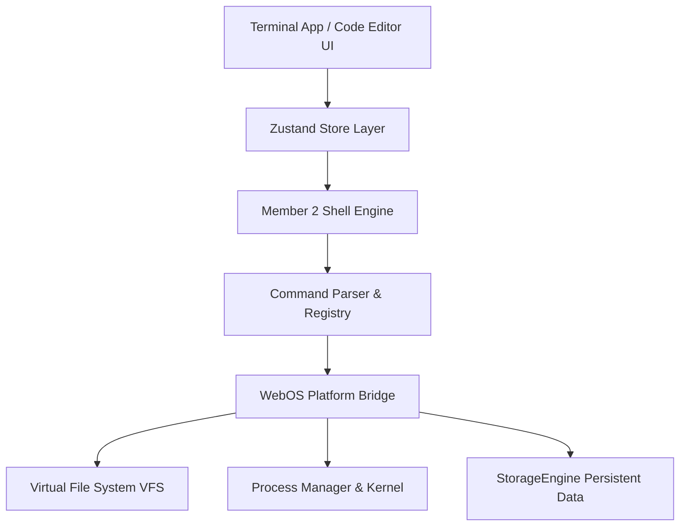

# WebOS Module 3.2 — Developer Tools & Terminal Architecture

## Overview
WebOS Module 3.2 delivers a complete, professional, in-browser command-line and programming environment consisting of the **Terminal Application**, **Code Editor (VS-Code-like IDE)**, and the **Member 2 Shell Engine**.

All developer tools run 100% locally inside the WebOS client environment without external API keys or paid third-party services.

---

## Component Architecture

### 1. Member 2 Shell Engine (`core/shell/`)
- **`CommandParser.ts`**: High-performance AST tokenizer supporting double/single quotes, space escaping (`\ `), flags (`-la`, `--sort=name`), environment variable expansion (`$HOME`, `$PATH`), pipes (`|`), and redirection (`>`, `>>`).
- **`CommandRegistry.ts`**: Built-in registry with 35+ shell commands (`pwd`, `cd`, `ls`, `mkdir`, `touch`, `cat`, `head`, `tail`, `cp`, `mv`, `rm`, `rename`, `find`, `grep`, `tree`, `stat`, `file`, `history`, `whoami`, `date`, `time`, `echo`, `env`, `export`, `alias`, `unalias`, `open`, `apps`, `ps`, `kill`, `jobs`, `version`, `about`).
- **`AutocompleteEngine.ts`**: Context-aware autocomplete for commands, flags, and VFS paths.
- **`Member2Shell.ts`**: Core shell engine maintaining working directory state, environment variables, aliases, history persistence, and event bus emissions.

### 2. Terminal Application (`applications/terminal/`)
- **Multi-Tab Sessions**: Independent working directory, output log, and history buffer per terminal tab.
- **Output Rendering**: Formatted plain text, multiline blocks, status colors (success, error, warning, info), scrollback buffer limit, auto-scroll, and clear screen.
- **Command History & Search**: Persistent command history, Arrow Up/Down navigation, and interactive `Ctrl+R` reverse search.
- **Keyboard Shortcuts**: `Enter` (run), `Tab` (autocomplete), `Ctrl+R` (search), `Ctrl+L` (clear).

### 3. Code Editor (`applications/code-editor/`)
- **VS-Code-like Workspace**: Activity bar, VFS file explorer tree, tab bar with dirty indicators (`*`), line numbers column, active line highlight, status bar, and customizable settings modal.
- **Syntax Highlighting**: Custom tokenizer supporting JavaScript, TypeScript, HTML, CSS, JSON, Markdown, Python, Java, C/C++, SQL, and Shell scripts.
- **Find & Replace**: Find next/previous, Replace, Replace All with case-sensitivity, whole-word, and regex matching.
- **Integrated Terminal**: Embedded Member 2 Shell terminal pane connected directly to VFS and Process Manager.
- **Command Palette**: Searchable action palette (`Ctrl+Shift+P`) executing real IDE commands.

---

## Verification & Testing
- **TypeScript Typecheck**: `npm run typecheck` (0 errors)
- **Unit & Integration Tests**: `npx vitest run tests/` (100% pass rate)
- **Production Build**: `npm run build` (0 errors)
- **GitHub Branch**: `feature/member3-module-3-2`
